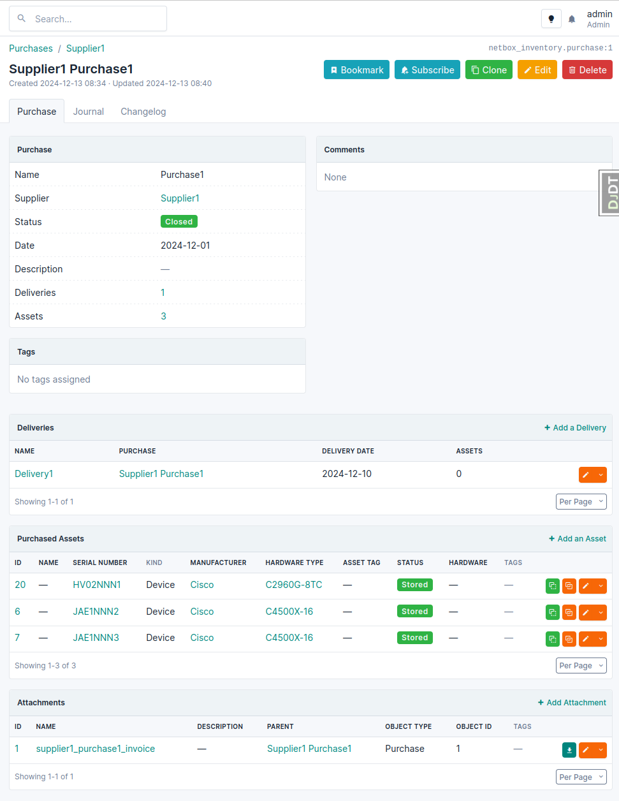

# NetBox Inventory Plugin

A [Netbox](https://github.com/netbox-community/netbox) plugin for hardware inventory.

## Features

Keep track of your hardware, whether it is installed or in storage. You can
define assets that represent hardware that can be used as a device, module, inventory item or rack in NetBox.

Each asset can have a storage location defined, when not in use. You can assign
an asset to a device, module or inventory item. The plugin can keep serial number
and asset tag between asset and device, module, inventory item or rack in sync if
enabled in settings.

On Site and Location detail views there is a new tab Assets that can show assets
that are stored or installed at that location or both. Rack details view also has
a tab for installed Assets. This provides a unified view of all assets at a given
location.

To properly support inventory items (that are used in NetBox to model SFP and
similar modules) the plugin defines inventory item types that are equivalent to
device types and module types. 

Inventory item types can be assigned into inventory item groups. On a group detail
view you have an overview of the number of contained assets broken down by asset
status or inventory item type and status. This way you can quickly see how many
of a certain type of hardware you still have spare.

Inventory item groups can be nested, so you can for example model all pluggables
as one top-level group with child groups for SFP+ modules, SFP28 modules and so
on.

### Automatic management of asset status

Each asset has a status attribute that can indicate use of the asset. These
statuses can be set as needed by each NetBox installation.

Two statuses can have a special meaning. One to indicate asset is in storage and one
to indicate asset is in use.

netbox_inventory can automatically set status to the value specified in
`used_status_name` configuration item when an asset is assigned to a device, module
or inventory item.

When you remove an asset from device, module or inventory item the plugin will set
asset status to `stored_status_name` configuration item.

To disable automatically changing status, set these two config parameters to `None`.

### Prevent unwanted changes for tagged assets

With `asset_disable_editing_fields_for_tags` and `asset_disable_deletion_for_tags` you can prevent changes to specified asset data for assets that have certain tags attached. Changes are only prevented via web interface. API modifications are allowed.

The idea is that an external system uses some assets stored in netbox_inventory, and you want to prevent accidental changes to data directly in NetBox web interface. Only that external system should modify the data.

### Audit

Audit flows can be defined to audit the inventory on site. This feature is not limited
to assets, it can be used to audit any object managed in NetBox.

* **Audit Flow Pages** allow the definition of user views that list specific NetBox
  objects. These can be filtered by object type and field values.
* **Audit Flows** group multiple Audit Flow Pages into a single flow. A flow can be
  initiated from a location type object (e.g. a `Location` or `Site`) using the
  **[Audit]** button on its detail page. The audit flow will then display all audit flow
  pages and their defined NetBox objects, restricted to the location for which the flow
  is running.
* **Audit Trails** document when an object has been verified to be in the specified
  location. An audit trail can either be created directly when running an audit flow, or
  imported from other systems using the API or an import form.
* **Audit Trail Sources** can be used to optionally identify the source of an audit
  trail. This option is only available when importing audit trails via the API or Import
  form.

#### Required Permissions

To run an audit flow, users need the `run` permission on the specific audit flow object.
View permissions are also required for the object from which the audit flow is initiated
(e.g. the `Site` or `Location`).

Audited objects within the audit flow can be viewed without additional permissions.
However, permissions are required to add, edit, or delete audited objects.

To mark an object as seen (i.e. to create an audit trail), the `add` and `delete`
permissions should be granted on the audit trail model.

#### Creating Audit Trails

Each row of an audit flow page table begins with a button to mark an object as seen.
Clicking this button creates an audit trail for documentation. Bulk marking of multiple
objects as seen is also provided.

However, there is a way to speed up this process even more: The quick search input field
on each page automatically gets the focus. Entering values into it will trigger the
regular quick search. When the form is submitted (e.g. by hitting `[Enter]`), the value
will be processed using the object's filterset:

1. If only one result remains after filtering the current page, this object is
   automatically marked as seen.
2. If there is only one result after filtering all objects of the processed object type,
   the user will be redirected to it's edit form. It is assumed that the location of the
   object is not correctly documented (e.g. the object has been moved). After submitting
   the changes, the user is returned to the audit flow page and can now mark it as seen.
3. If no matching object is found, a warning is displayed. The user must manually create
   the object.

> [!TIP]
> To further speed up this process, you can use a barcode or QR code scanner.

#### Audit Reports

At this time, this plugin does not include any reporting on the current audit status of
objects, as simple-looking implementations can lead to many different ways of evaluating
and aggregating the data for different use cases. However, most, if not all,
implementations can be done with a [custom script][nbScript]:

[nbScript]: https://netboxlabs.com/docs/netbox/en/stable/customization/custom-scripts/

```Python
from django.db.models import OuterRef, Q, Subquery

from core.models import ObjectType
from dcim.models import Device, Module
from extras.scripts import Script

from netbox_inventory.models import Asset, AuditTrail


class AuditReportMissing(Script):
    description = 'Check for missing audit trails of assets'

    def test_missing_audit_assets(self) -> None:
        queryset = Asset.objects.annotate(
            last_audit_date=Subquery(
                AuditTrail.objects.filter(
                    Q(
                        object_type=ObjectType.objects.get_for_model(Asset),
                        object_id=OuterRef('pk'),
                    )
                    # Also, check for the assigned device or module of an Asset.
                    | Q(
                        object_type=ObjectType.objects.get_for_model(Device),
                        object_id=OuterRef('device__pk'),
                    )
                    | Q(
                        object_type=ObjectType.objects.get_for_model(Module),
                        object_id=OuterRef('module__pk'),
                    )
                )
                .order_by('-created')
                .values_list('created', flat=True)[:1]
            )
        )

        for asset in queryset.filter(last_audit_date__isnull=True):
            self.log_warning('No recent audit for object found.', obj=asset)
```

## Compatibility

This plugin requires netbox version 4.5 to work. Older versions of the plugin
support older netbox version as per table below:

| NetBox Version | Plugin Version |
|----------------|----------------|
|       3.7      |      1.6.x     |
|       4.0      |      2.0.x     |
|       4.1      |  2.1.x,2.2.x   |
|       4.2      |      2.3.x     |
|       4.3      |      2.4.0     |
|       4.4      |    >=2.4.1     |
|       4.5      |      2.5.0     |

## Installing

Review [official Netbox plugin documentation](https://docs.netbox.dev/en/stable/plugins/#installing-plugins) for installation instructions.

You install the plugin from pypi with pip. Make sure you activate Netbox's virtual
environment first:

```bash
$ source /opt/netbox/venv/bin/activate
(venv) $ pip install netbox-inventory
```

For adding to a NetBox Docker setup see
[the general instructions for using netbox-docker with plugins](https://github.com/netbox-community/netbox-docker/wiki/Using-Netbox-Plugins).

You can install a development version directly from GitHub:

```bash
pip install https://github.com/ArnesSI/netbox-inventory/archive/master.tar.gz
```

or by adding to your `local_requirements.txt` or `plugin_requirements.txt` (netbox-docker):

```bash
https://github.com/ArnesSI/netbox-inventory/archive/master.tar.gz
```

After installation, enable the plugin in `/opt/netbox/netbox/netbox/configuration.py`,
 or if you use netbox-docker, your `/configuration/plugins.py` file :

```python
PLUGINS = [
    'netbox_inventory'
]

PLUGINS_CONFIG = {
    "netbox_inventory": {},
}
```

Available configuration settings you can use in `PLUGINS_CONFIG` are described
below under [settings](#settings).

The last step is to apply database migrations and update netbox search index:

```bash
(venv) $ cd /opt/netbox/netbox/
(venv) $ python3 manage.py migrate
(venv) $ python3 manage.py reindex --lazy
```

If you're running under netbox-docker, you can skip this as migrations and index updates are applied if needed automatically when you bring up the containers.

### Settings

If you want to override the defaults for the plugin, you can do so in your via `/opt/netbox/netbox/netbox/configuration.py`,
 or if you use netbox-docker, your `/configuration/plugins.py` file :

```python
PLUGINS = [
    'netbox_inventory'
]

PLUGINS_CONFIG = {
    "netbox_inventory": {
        # Example settings below, see "Available settings"
        # in README.md for all possible settings
        "used_status_name": "used",
        "stored_status_name": "stored",
        "sync_hardware_serial_asset_tag": True,
    },
}
```

#### Available settings

| Setting | Default value | Description |
|---------|---------------|-------------|
| `top_level_menu` | `True`| Add netbox-inventory to the top level of netbox navigation menu under Inventory heading. If set to False the plugin will add a menu item under the Plugins menu item.
| `used_status_name` | `'used'`| Status that indicates asset is in use. See "Automatic management of asset status" below for more info on this setting.
| `used_additional_status_names` | `[]` (empty list) | List of statuses that are also considered as in use.
| `stored_status_name` | `'stored'`| Status that indicates asset is in storage. See "Automatic management of asset status" below for more info on this setting.
| `stored_additional_status_names` | `['retired',]`| List of statuses that are also considered as not in use by various filters.
| `sync_hardware_serial_asset_tag` | `False` | When an asset is assigned or unassigned to a device, module or inventory item, update its serial number and asset tag to be in sync with the asset? For device and module device type or module type is also updated to match asset. For inventory items, manufacturer and part ID are updated to match asset. |
| `asset_import_create_purchase` | `False` | When importing assets, automatically create any given purchase, delivery or supplier if it doesn't exist already |
| `asset_import_create_device_type` | `False` | When importing a device type asset, automatically create manufacturer and/or device type if it doesn't exist |
| `asset_import_create_module_type` | `False` | When importing a module type asset, automatically create manufacturer and/or module type if it doesn't exist |
| `asset_import_create_inventoryitem_type` | `False` | When importing an inventory type asset, automatically create manufacturer and/or inventory item type if it doesn't exist |
| `asset_import_create_rack_type` | `False` | When importing a rack type asset, automatically create manufacturer and/or rack type if it doesn't exist |
| `asset_import_create_tenant` | `False` | When importing an asset, with owner or tenant, automatically create tenant if it doesn't exist |
| `asset_disable_editing_fields_for_tags` | `{}` | A dictionary of tags and fields that should be disabled for editing. This is useful if you want to prevent editing of certain fields for certain assets. The dictionary is in the form of `{tag: [field1, field2]}`. Example: `{'no-edit': ['serial_number', 'asset_tag']}`. This only affects the UI, the API can still be used to edit the fields. |
| `asset_disable_deletion_for_tags` | `[]` | List of tags that will disable deletion of assets. This only affects the UI, not the API. |
| `asset_custom_fields_search_filters` | `{}` | A dictionary of custom fields and lookup types that will be added to the search filters for assets. The dictionary is in the form of `{field: [lookup_type]}`. Example: `{'asset_mac': ['icontains', 'exact']}`. |
| `asset_warranty_expire_warning_days` | `90` | Days from warranty expiration to show as warning in Warranty remaining field |
| `prefill_asset_name_create_inventoryitem` | `False` | When hardware inventory item is created from an asset, prefill the InventoryItem name to match the asset name. |
| `prefill_asset_tag_create_inventoryitem` | `False` | When hardware inventory item is created from an asset, prefill the tags to match the tags associated to the asset. |
| `audit_window` | `240` | Defines a sliding timeframe starting from the current time in minutes. If an audit trail exists for a particular object in this window, it is marked as seen when an audit trail is run to avoid repeated actions. |

You can extend or define your own status choices for Asset, via [`FIELD_CHOICES`](https://docs.netbox.dev/en/stable/configuration/data-validation/#field_choices) setting in Netbox:

```
FIELD_CHOICES = {
    'netbox_inventory.Asset.status+': (
        ('repair', 'In repair', 'orange'),
    ),
}
```

If you add more statuses, you should also adjust `used_additional_status_names` and `stored_additional_status_names` settings.

The possible colours can be found at [FIELD_CHOICES](https://netboxlabs.com/docs/netbox/configuration/data-validation/#field_choices).

## Common questions

### I'd like to attach documents to asset, purchase, supplier, etc

Netbox inventory supports limited file attachments for its various models. You can add images to assets, inventory item types and that is it.

If you would like to attach various other documents to purchases, deliveries, suppliers... first ask yourself if you really need those documents in netbox or could you use some other tool that is possibly in use in your organization. Netbox itself is not great at managing documents. If you decide to manage documents outside netbox, you can probably still achieve some sort of integration by using [custom links feature](https://netboxlabs.com/docs/netbox/en/stable/customization/custom-links/) to link from a netbox inventory object directly to a document in your document system.

If you really want to store document in netbox itself, then consider using [netbox_attachments plugin](https://github.com/Kani999/netbox-attachments). Here is a sample netbox configuration that will allow adding documents to suppliers, purchases and deliveries:

```python
PLUGINS = [
    'netbox_inventory',
    'netbox_attachments',
]

PLUGINS_CONFIG = {
    'netbox_attachments': {
        'applied_scope': 'model',
        'scope_filter': [
            'netbox_inventory.supplier',
            'netbox_inventory.purchase',
            'netbox_inventory.delivery',
        ],
        'display_setting': {
            "netbox_inventory.supplier": "left_page",
            "netbox_inventory.purchase": "full_width_page",
            "netbox_inventory.delivery": "righ_page",
        },
    },
}
```

Look at [netbox-attachments](https://github.com/Kani999/netbox-attachments)
documentation for more configuration examples.

Here is what it looks like when viewing a purchase:



## Models

Current plugin data model:


## Screenshots

Asset - List View


Asset - Individual View


Asset - Edit / Add View


Asset - Lots of filtering options


Suppliers - Individual View


Inventory Item Type - List View


