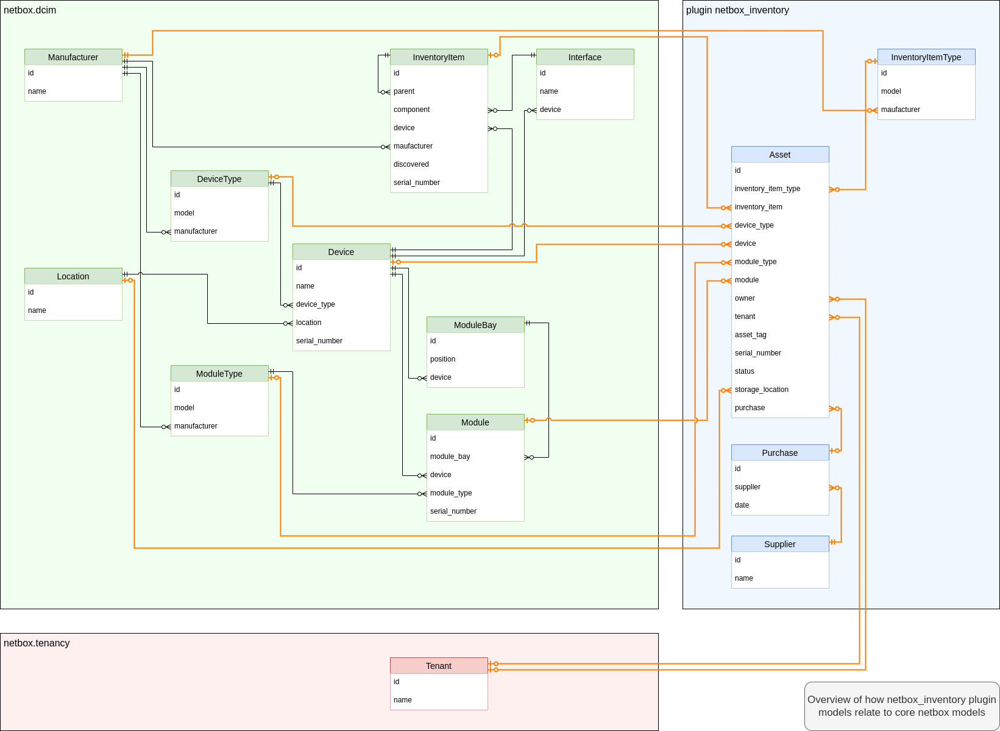
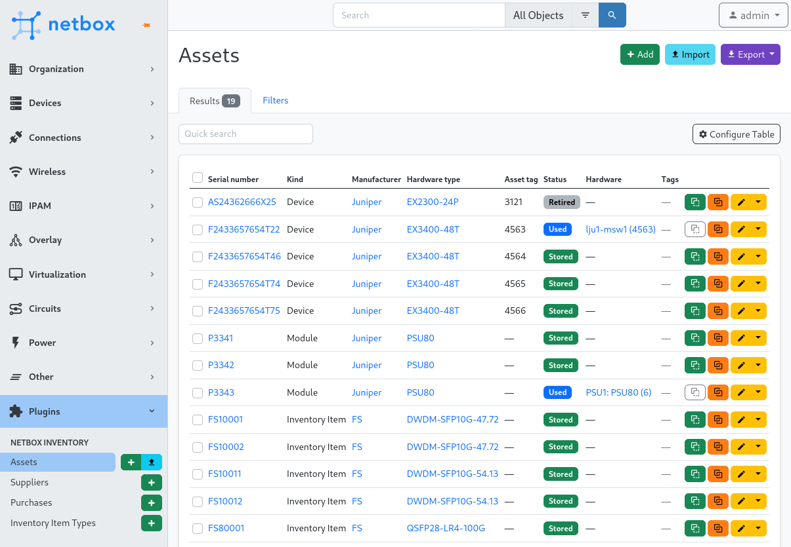
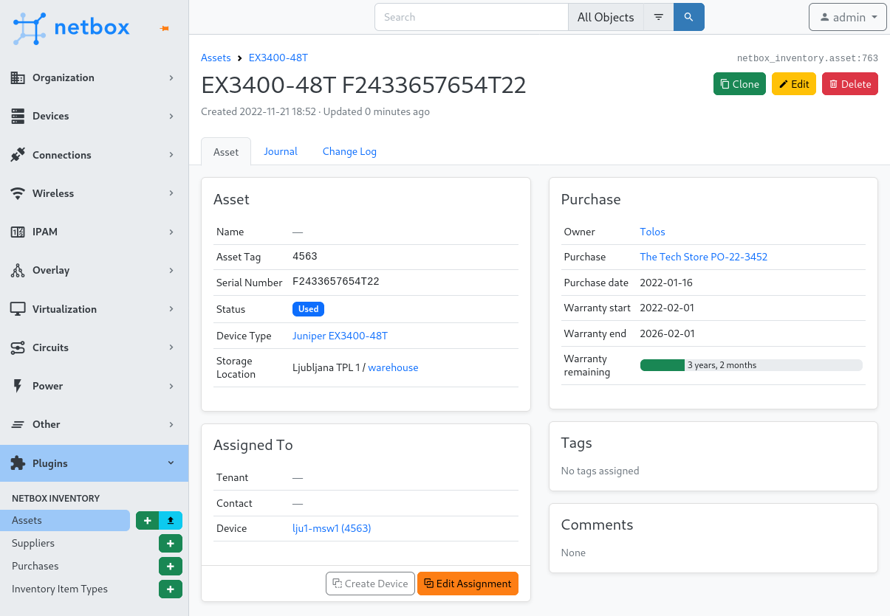
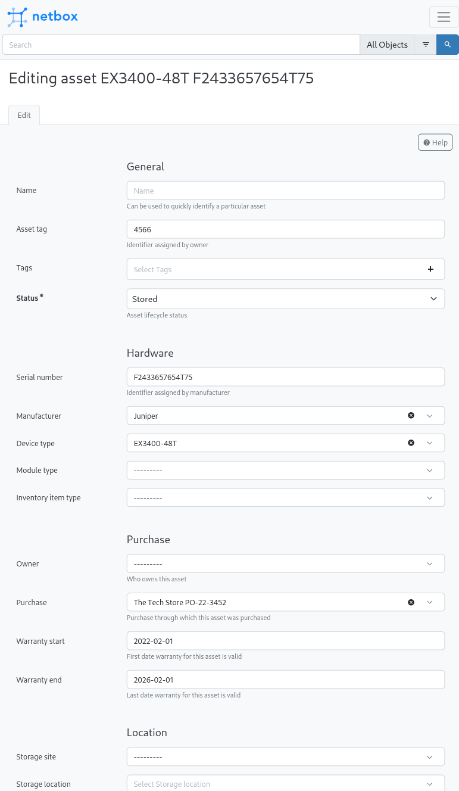
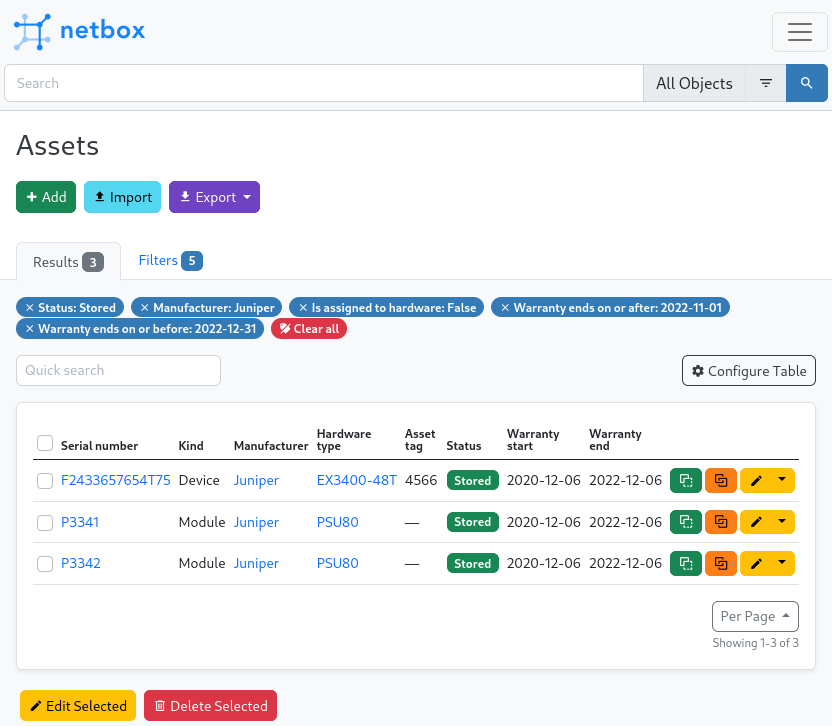
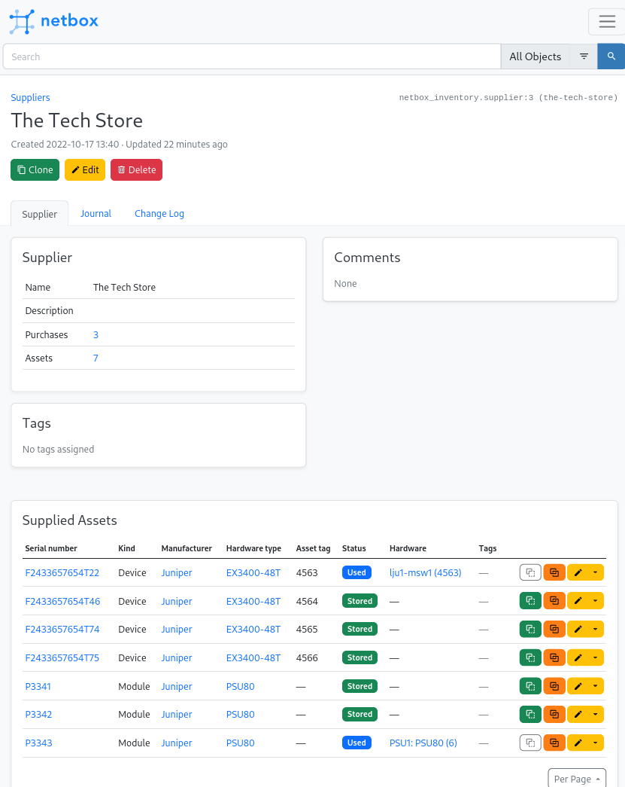
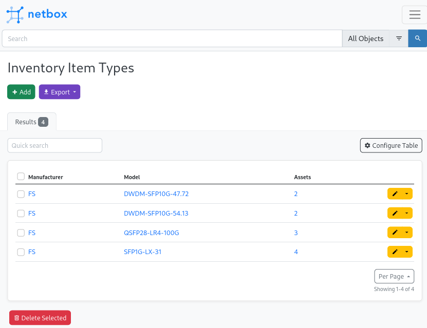

# NetBox Inventory Plugin

A [Netbox](https://github.com/netbox-community/netbox) plugin for hardware inventory.

## Features

Keep track of your hardware, whether it is installed or in storage. You can
define assets that represent hardware that can be used as a device, module or
inventory item in NetBox.

Each asset can have a storage location defined, when not in use. You can assign
an asset to a device, module or inventory item. The plugin can keep serial number
and asset tag between asset and device, module or inventory item in sync if
enabled in settings.

On Site and Location detail views there is a new tab Assets that can show assets
that are stored or installed at that location or both. Rack details view also has
a tab for installed Assets. This provides a unified view of all assets at a given
location.

To properly support inventory items (that are used in NetBox to model SFP and
similar modules) the plugin defines inventory item types that are equivalent to
device types and module types. 

Inventory item types can be assigned into inventory item groups. On a group detail
view you have an overview of the number of contained assets broken down by asset
status or inventory item type and status. This way you can quickly see how many
of a certain type of hardware you still have spare.

Inventory item groups can be nested, so you can for example model all pluggables
as one top-level group with child groups for SFP+ modules, SFP28 modules and so
on.

### Automatic management of asset status

Each asset has a status attribute that can indicate use of the asset. These
statuses can be set as needed by each NetBox installation.

Two statuses can have a special meaning. One to indicate asset is in storage and one
to indicate asset is in use.

netbox_inventory can automatically set status to the value specified in
`used_status_name` configuration item when an asset is assigned to a device, module
or inventory item.

When you remove an asset from device, module or inventory item the plugin will set
asset status to `stored_status_name` configuration item.

To disable automatically changing status, set these two config parameters to `None`.

### Prevent unwanted changes for tagged assets

With `asset_disable_editing_fields_for_tags` and `asset_disable_deletion_for_tags` you can prevent changes to specified asset data for assets that have certain tags attached. Changes are only prevented via web interface. API modifications are allowed.

The idea is that an external system uses some assets stored in netbox_inventory, and you want to prevent accidental changes to data directly in NetBox web interface. Only that external system should modify the data.

## Compatibility

This plugin requires netbox version 3.4.x to work. Older versions of the plugin
support older netbox version as per table below:

| NetBox Version | Plugin Version |
|----------------|----------------|
|       3.3      |      1.1.x     |
|       3.4      |      1.2.x     |

## Installing

Review [official Netbox plugin documentation](https://docs.netbox.dev/en/stable/plugins/#installing-plugins) for installation instructions.

You install the plugin from pypi with pip. Make sure you activate Netbox's virtual
environment first:

```bash
$ source /opt/netbox/venv/bin/activate
(venv) $ pip install netbox-inventory
```

For adding to a NetBox Docker setup see
[the general instructions for using netbox-docker with plugins](https://github.com/netbox-community/netbox-docker/wiki/Using-Netbox-Plugins).

You can install a development version directly from GitHub:

```bash
pip install git+https://github.com/ArnesSI/netbox-inventory.git@master
```

or by adding to your `local_requirements.txt` or `plugin_requirements.txt` (netbox-docker):

```bash
git+https://github.com/ArnesSI/netbox-inventory.git@master
```

After installation, enable the plugin in `/opt/netbox/netbox/netbox/configuration.py`,
 or if you use netbox-docker, your `/configuration/plugins.py` file :

```python
PLUGINS = [
    'netbox_inventory'
]

PLUGINS_CONFIG = {
    "netbox_inventory": {},
}
```

Available configuration settings you can use in `PLUGINS_CONFIG` are described
below under [settings](#settings).

The last step is to apply database migrations and update netbox search index:

```bash
(venv) $ cd /opt/netbox/netbox/
(venv) $ python3 manage.py migrate
(venv) $ python3 manage.py reindex --lazy
```

If you're running under netbox-docker, you can skip this as migrations and index updates are applied if needed automatically when you bring up the containers.

### Settings

If you want to override the defaults for the plugin, you can do so in your via `/opt/netbox/netbox/netbox/configuration.py`,
 or if you use netbox-docker, your `/configuration/plugins.py` file :

```python
PLUGINS = [
    'netbox_inventory'
]

PLUGINS_CONFIG = {
    "netbox_inventory": {
        # Example settings below, see "Available settings"
        # in README.md for all possible settings
        "used_status_name": "used",
        "stored_status_name": "stored",
        "sync_hardware_serial_asset_tag": True,
    },
}
```

#### Available settings

| Setting | Default value | Description |
|---------|---------------|-------------|
| `top_level_menu` | `True`| Add netbox-inventory to the top level of netbox navigation menu under Inventory heading. If set to False the plugin will add a menu item under the Plugins menu item. This setting is only valid under netbox v3.4 and newer.
| `used_status_name` | `'used'`| Status that indicates asset is in use. See "Automatic management of asset status" below for more info on this setting.
| `stored_status_name` | `'stored'`| Status that indicates asset is in storage. See "Automatic management of asset status" below for more info on this setting.
| `sync_hardware_serial_asset_tag` | `False` | When an asset is assigned or unassigned to a device, module or inventory item, update its serial number and asset tag to be in sync with the asset? |
| `asset_import_create_purchase` | `False` | When importing assets, automatically create purchase (and supplier) if it doesn't exist |
| `asset_import_create_device_type` | `False` | When importing a device type asset, automatically create manufacturer and/or device type if it doesn't exist |
| `asset_import_create_module_type` | `False` | When importing a module type asset, automatically create manufacturer and/or device type if it doesn't exist |
| `asset_import_create_inventoryitem_type` | `False` | When importing an inventory type asset, automatically create manufacturer and/or device type if it doesn't exist |
| `asset_import_create_tenant` | `False` | When importing an asset, with owner or tenant, automatically create tenant if it doesn't exist |
| `asset_disable_editing_fields_for_tags` | `{}` | A dictionary of tags and fields that should be disabled for editing. This is useful if you want to prevent editing of certain fields for certain assets. The dictionary is in the form of `{tag: [field1, field2]}`. Example: `{'no-edit': ['serial_number', 'asset_tag']}`. This only affects the UI, the API can still be used to edit the fields. |
| `asset_disable_deletion_for_tags` | `[]` | List of tags that will disable deletion of assets. This only affects the UI, not the API. |

You can extend or define your own status choices for Asset, via [`FIELD_CHOICES`](https://docs.netbox.dev/en/stable/configuration/data-validation/#field_choices) setting in Netbox:

```
FIELD_CHOICES = {
    'netbox_inventory.Asset.status+': (
        ('repair', 'In repair', 'orange'),
    ),
}
```

## Models

Current plugin data model:



## Screenshots

Asset - List View



Asset - Individual View



Asset - Edit / Add View



Asset - Lots of filtering options



Suppliers - Individual View



Inventory Item Type - List View


