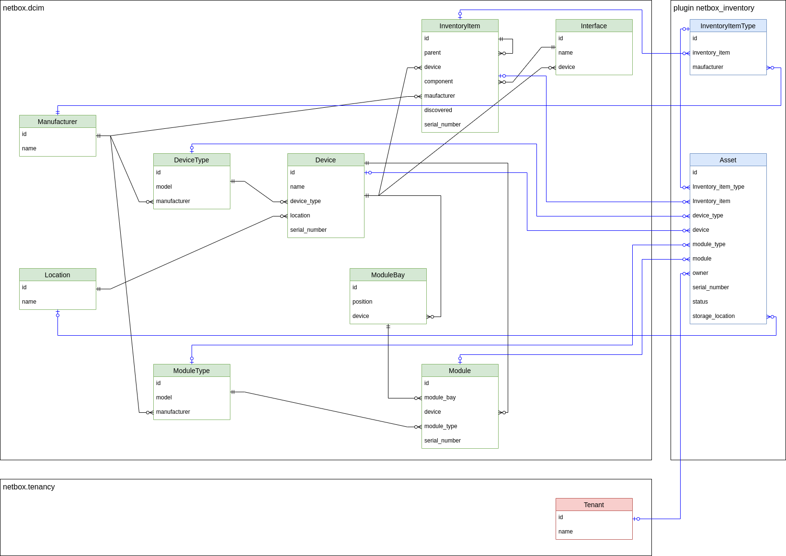

# NetBox Inventory Plugin

A [Netbox](https://github.com/netbox-community/netbox) plugin for hardware inventory.

## Models

Current v0.1.x model:



## Features

Keep track of your hardware, whether it is installed or in storage. You can
define assets that represent hardware that can be used as a device, module or
inventory item in NetBox.

Each asset can have a storage location defined, when not in use. You can assign
an asset to a device or module. The plugin can keep serial number and asset tag
between asset and device or module in sync if enabled in settings.

To properly support inventory items (that are used in NetBox to model SFP and
similar modules) the plugin defines inventory item types that are equivalent to
device types and module types.

## Automatic management of asset status

Each asset has a status attribute that can indicate use of the asset. These
statuses can be set as needed by each NetBox installation.

Two statuses can have a special meaning. One to indicate asset is in storage and one
to indicate asset is in use.

netbox_inventory can automatically set status to the value specified in
`used_status_name` configuration item when an asset is assigned to a device, module
or inventory item.

When you remove an asset from device, module or inventory item the plugin will set
asset status to `stored_status_name` configuration item.

To disable automatically changing status, set these two config parameters to `None`.

## Compatibility

This plugin was first developed using 3.2.5, and tested with all of 3.2.

| NetBox Version | Plugin Version |
|----------------|----------------|
|       3.2      |      0.1.3     |
|       3.3      |      0.1.3     |

## Installing

For adding to a NetBox Docker setup see
[the general instructions for using netbox-docker with plugins](https://github.com/netbox-community/netbox-docker/wiki/Using-Netbox-Plugins).

While this is still in development and not yet on pypi you can install with pip:

```bash
pip install git+https://github.com/ArnesSI/netbox-inventory.git@dev
```

or by adding to your `local_requirements.txt` or `plugin_requirements.txt` (netbox-docker):

```bash
git+https://github.com/ArnesSI/netbox-inventory.git@dev
```

Enable the plugin in `/opt/netbox/netbox/netbox/configuration.py`,
 or if you use netbox-docker, your `/configuration/plugins.py` file :

```python
PLUGINS = [
    'netbox_inventory'
]

PLUGINS_CONFIG = {
    "netbox_inventory": {},
}
```

### Settings

If you want to override the defaults for the plugin, you can do so in your via `/opt/netbox/netbox/netbox/configuration.py`,
 or if you use netbox-docker, your `/configuration/plugins.py` file :

```python
PLUGINS = [
    'netbox_inventory'
]

PLUGINS_CONFIG = {
    "netbox_inventory": {
        # Example settings below
        "used_status_name": "In use",
        "stored_status_name": "In storage",
        "sync_serial_number": True,
        "sync_asset_tag": True,
    },
}
```

| Setting | Default value | Description |
|---------|---------------|-------------|
| `used_status_name` | `'used'`| Status that indicates asset is in use. See "Automatic management of asset status" below for more info on this setting.
| `stored_status_name` | `'stored'`| Status that indicates asset is in storage. See "Automatic management of asset status" below for more info on this setting.
| `sync_hardware_serial_asset_tag` | `False` | When an asset is assigned or unassigned to a device, module or inventory item, update its serial number and asset tag to be in sync with the asset? |
| `asset_import_create_purchase` | `False` | When importing assets, automatically create purchase (and supplier) if it doesn't exist |
| `asset_import_create_device_type` | `False` | When importing a device type asset, automatically create manufacturer and/or device type if it doesn't exist |
| `asset_import_create_module_type` | `False` | When importing a module type asset, automatically create manufacturer and/or device type if it doesn't exist |
| `asset_import_create_inventoryitem_type` | `False` | When importing an inventory type asset, automatically create manufacturer and/or device type if it doesn't exist |
| `asset_disable_editing_fields_for_tags` | `{}` | A dictionary of tags and fields that should be disabled for editing. This is useful if you want to prevent editing of certain fields for certain assets. The dictionary is in the form of `{tag: [field1, field2]}`. Example: `{'no-edit': ['serial_number', 'asset_tag']}`. This only affects the UI, the API can still be used to edit the fields. |
| `asset_disable_deletion_for_tags` | `[]` | List of tags that will disable deletion of assets. This only affects the UI, not the API. |

## Screenshots

Asset  - List View


Asset - Individual View


Asset - Edit View / Add View


Suppliers  - List View


Suppliers - Individual View


Suppliers - Edit View / Add View


Inventory Item Type  - List View


Inventory Item Type - Individual View


Inventory Item Type - Edit View / Add View


## Future development ideas

- location report
- supplier detail - show assets
- device on_delete update asset.status (if asset assigned)
- prevent device.device_type/serial/asset_tag change if asset assigned (and sync_hardware_serial_asset_tag=true?) see [AbortRequest](https://github.com/netbox-community/netbox/issues/9075)
- inject asset list on manufacturer detail?
- inventoryitem detail - show asset info
- inventoryitem_type - assign existing, bulk, show assets, more testing
- bootstrap scripts to generate assets from existing device/module S/N data
- from device details view -> to change asset, assign asset
- supplier import, bulk edit
- how to assign MACs to device/module interfaces that is created from Asset
